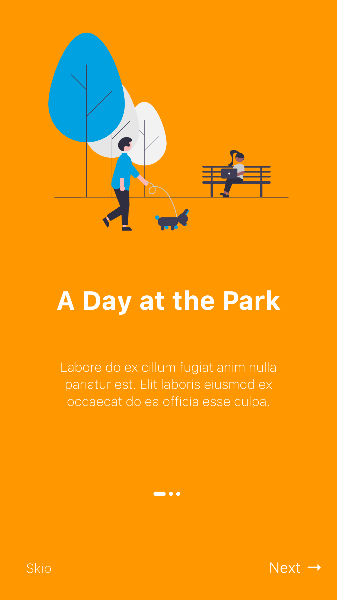
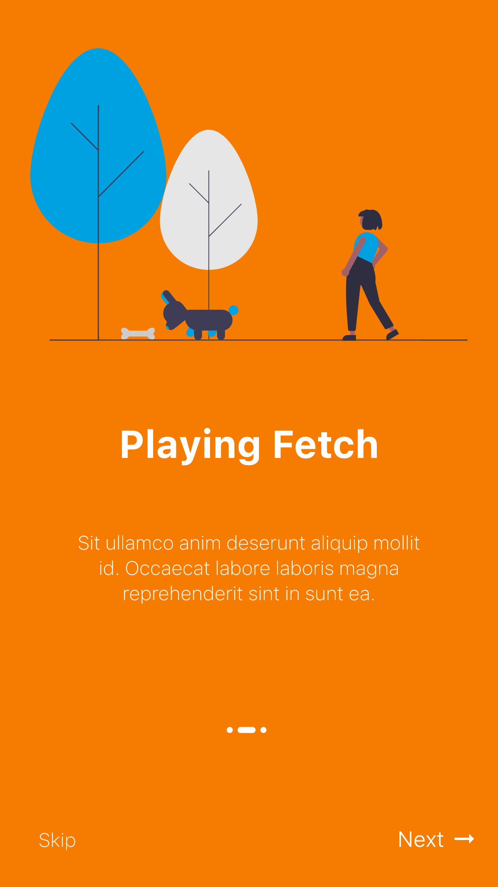

# Flutter Onboarding Screens

The idea behind this example is the implementation of an app onboarding experience in Flutter. Works on Android and iOS.

This was inspired by a post [on Dribble](https://dribbble.com/shots/14926348-App-onboarding-design). The SVG files are from [unDraw](https://undraw.co).

## Example

  
  
  

[YouTube Preview](https://www.youtube.com/watch?v=XgtzUORaYKU)

For more: [mariusreimer.com](https://mariusreimer.com)
